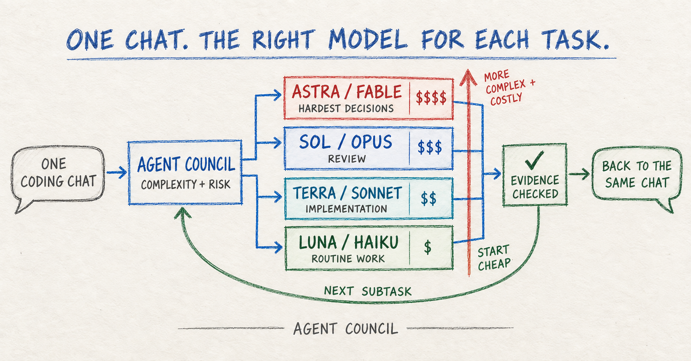

# Agent Council

Use different AI models from one coding chat, without switching them by hand.



Agent Council lets your main Codex or Claude Code chat hand a subtask to the model tier that fits the work:

- A fast, economical model for routine checks and evidence gathering.
- A technical model for a bounded implementation.
- A stronger model for difficult diagnosis, review, or architecture.
- A top-tier model for routing and final decisions.

In Codex, that can mean Luna for routine work, Terra for implementation, Sol for review, and Astra for the hardest decisions.

You stay in the same chat. The main agent decides when to delegate, starts the sub-agent with an explicit model, and brings the result back into the task.

## Why this exists

Manually changing models creates two kinds of waste:

- Keep a premium model running and you spend expensive tokens on easy work.
- Keep a cheaper model on a hard problem and you can burn through retries before escalating anyway.

Then, once the hard part is over, you have to remember to switch back down. The repeated handoff breaks your flow and makes one task feel like several separate sessions.

Agent Council moves that routing decision into the chat. It can escalate when the work becomes harder, use a cheaper worker for routine steps, and require a separate reviewer when the result needs an independent check.

It does not read your remaining quota or predict cost. It routes from the task's complexity and risk.

## What happens during a task

The main chat classifies the current piece of work:

- **R1**: a bounded fix with a known cause and narrow impact.
- **R2**: an unexpected failure or uncertain composition.
- **R3**: architecture, shared contracts, safety boundaries, or repeated unresolved failures.

That route tells the chat which model tier and checks are required. The chat launches the sub-agents. Agent Council records the routing decision, checks the returned model identity and evidence links, and refuses to close the case when required checks are missing or stale.

The local engine uses only the Python standard library.

## Install

**Codex:**

```sh
codex plugin marketplace add mustafaqasim/agent-council --ref main
codex plugin add agent-council@agent-council
```

**Claude Code:**

```sh
claude plugin marketplace add mustafaqasim/agent-council
claude plugin install agent-council@agent-council
```

Start a new task after installation so the skill loads.

## What it does not do

- The local engine does not call model providers. The main chat delegates through the native Codex or Claude Code tools.
- It does not guarantee that a provider actually ran the model it claims. It verifies identity based on observed tool results, not provider assertions.
- It does not dynamically benchmark models or guarantee every model in the registry is available on your account.
- Compound Engineering is optional. The plugin works without it.

## Safety boundary

Case records require `--project-root` and `--case-root` to point to a directory you control. The engine resolves all paths inside that boundary and refuses mutations through a different root or a symlinked path.

This protects against accidental writes by the current user. It is not a sandbox against a malicious process running as the same user.

The engine rejects common secret-shaped values before writing a record. That is pattern-matching, not a guarantee. Do not pass secrets as command-line arguments or in evidence fields.

## Development

Run the plugin check and contract groups from the plugin directory:

```sh
cd plugins/agent-council
python3 scripts/Test-AgentCouncilPlugin.py
for group in schema lifecycle stages routes provider authoring security dispatch-contracts; do
  python3 scripts/core/agent-council/0.2.0/Test-AgentCouncilContracts.py --group "$group"
done
```

See [SECURITY.md](SECURITY.md), [CONTRIBUTING.md](CONTRIBUTING.md), and [MIGRATION.md](MIGRATION.md).
